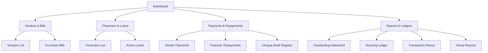

# Vastrams: Vendor & Finance Management System
## Developer Documentation & Architecture Overview

Welcome to the developer documentation for **Vastrams - Vendor & Finance Management System**. This document outlines the functional layout, routing, database model, business logic, and UI design patterns used across the platform.

---

## 1. System Architecture & High-Level Design

Vastrams is a modern, responsive back-office web application designed to handle vendor transactions, financier loans, payment reconciliations, and interest calculation.

### Core Technical Pillars:
* **UI/UX Design Language**: Uses Tailwind CSS with a modern dark sidebar navigation, contrasting content panels, responsive data grids, Radix UI-inspired components, and clean data visualizations.
* **State Management**: Built on React state (persisted on client-side Replit instance or local/session databases) enabling real-time updates and seamless state transit across tabs.
* **Soft Deletion Pattern**: All transaction actions (bills, loans, payments, repayments) utilize a soft-delete attribute (`status: "deleted" / "active"`) preserving history for auditing while excluding them from running balances.
* **Reconciliation Strategy**: Utilizes a First-In-First-Out (FIFO) allocation algorithm for payments and repayments against outstanding bills and loans.

---

## 2. Comprehensive Route Map & Pages Reference

The application uses client-side routing to navigate the different modules. Here is a breakdown of every page, its form validation requirements, and interaction outcomes.

| Module | Route / URI | Target Actions / Forms | Key Interactive Features |
| :--- | :--- | :--- | :--- |
| **Dashboard** | `/` | Home metrics, overall outstanding | Bar charts, top vendors/financiers tables |
| **Vendors** | `/vendors` | Add Vendor (`/vendors/new`), Edit/Delete | Category select, GST/IFSC bank details |
| **Purchase Bills** | `/bills` | Add Bill (`/bills/new`), Delete | Combobox selector, credit/cash type |
| **Financiers** | `/financiers` | Add Financier (`/financiers/new`), Edit/Delete | Loan tracker counters |
| **Loans** | `/loans` | Add Loan (`/loans/new`), Delete | Interest Rate (%) tracker, status badge |
| **Vendor Payments** | `/vendor-payments` | Add Payment (`/vendor-payments/new`), Delete | Dynamic cheque fields, FIFO preview |
| **Fin. Repayments** | `/financier-payments` | Add Repayment (`/financier-payments/new`), Delete | FIFO preview allocation modal |
| **Cheques** | `/cheques` | Add Cheque (`/cheques/new`), State modification | State transitions (Pending, Cleared, Bounced) |
| **Outstanding** | `/outstanding` | Party type filters, aging overview | Days-overdue indicators, oldest bill tracking |
| **Ledger** | `/ledger` | Search, transaction filter, date filter | Running balance table with debit/credit logs |
| **Transactions** | `/transactions` | Filter by type/party, soft-delete toggle | Audit log showing deleted items in red |
| **Reports** | `/reports` | Vendor, Financier, Payment, Overdue, Charts | Recharts bar charts for monthly/yearly volume |

---

## 3. Detailed Route-by-Route Breakdown

### 3.1 Dashboard (`/`)
* **KPI Metrics Dashboard**:
  * **Total Outstanding**: Combined value of all unpaid purchase bills and active loans.
  * **Vendor Outstanding vs Financier Outstanding**: Quick separation showing trade payables vs debt financing.
  * **Overdue Bills Tracker**: Flags purchase bills past their due date with active count and total overdue rupees.
  * **Cheques In Transit**: Upcoming pending cheques needing clearance.
* **Visual Components**:
  * Dual bar-graph illustrating Outstanding Breakdown.
  * Side-by-side grids highlighting top debtors/parties.

### 3.2 Vendors Management (`/vendors`)
* **List Properties**: Displays Code, Vendor Name, Type (e.g. Big Vendor), Outstanding Amount (color-coded red/green), status, and action buttons.
* **Create Form (`/vendors/new`)**:
  * `Vendor Name` (String, Required)
  * `Vendor Type` (Select: "Small Vendor", "Big Vendor", "Manufacturer", "Service Provider", Required)
  * `GST Number` (Alphanumeric, 15 chars format validation)
  * `Opening Balance` (Number, Defaults to 0)
  * `Bank Name`, `Account Number`, `IFSC Code` (Optional)

### 3.3 Purchase Bills (`/bills`)
* **List Properties**: Details Bill #, Vendor, Bill Date, Due Date, Total Amount, Paid Amount, Outstanding Amount, and Status (Ongoing / Paid / Overdue).
* **Filters**: Quick combobox filter to isolate bills belonging to a single vendor.
* **Create Form (`/bills/new`)**:
  * `Vendor` (Combobox dropdown populated with existing active vendors, Required)
  * `Bill Number` (String, Required)
  * `Bill Date` & `Due Date` (Date Pickers; checks that Due Date is $\ge$ Bill Date)
  * `Amount` (Numeric, Positive validation)
  * `Remarks` (Text area, Optional)

### 3.4 Financiers (`/financiers`)
* **List Properties**: Displays Name, Phone, active loan counts, outstanding, and status.
* **Create Form (`/financiers/new`)**:
  * `Name` (String, Required)
  * `Phone` & `Address` (Optional strings)
  * `Status` (Dropdown: Active / Inactive)

### 3.5 Loans (`/loans`)
* **List Properties**: Note #, Financier, Loan Date, Amount, Paid, Outstanding, Interest rate, and Status.
* **Create Form (`/loans/new`)**:
  * `Financier` (Dropdown populated with active financiers)
  * `Note Number` (String, Required for reference)
  * `Loan Date` (Date Picker)
  * `Amount` (Numeric, Required)
  * `Interest Rate (%)` (Percentage number, Optional)

### 3.6 Vendor Payments & Financier Repayments (`/vendor-payments` & `/financier-payments`)
* **Core Business Logic - FIFO Allocation**:
  Rather than requiring manual linkage of payments to specific bills/loans, the application uses a FIFO engine. When a payment is recorded:
  1. The code retrieves all unpaid or partially paid bills/loans for the selected party, ordered chronologically by creation date.
  2. The payment amount is allocated sequentially to the oldest document until the payment is exhausted.
  3. If there is a surplus, it is treated as an unallocated advance balance.
* **Form Structure**:
  * `Party Selector` (Vendor / Financier, Required)
  * `Amount` (Numeric, Required)
  * `Payment Date` (Date Picker)
  * `Payment Mode` (Select: "Cash", "UPI", "NEFT", "RTGS", "Cheque")
* **Dynamic Form Interaction**:
  If "Cheque" is selected, the UI injects a conditional panel:
  * `Cheque Number` (Required)
  * `Cheque Date` (Required)
  * `Cheque Book #` (Optional)
  * `Bank Name` (Required)
* **Reconciliation Preview Modal**:
  Before submission, the "Preview Allocation" action queries the allocation simulator. It brings up a Radix UI dialog displaying a tabular dry-run of how the amount will be split (e.g. *Bill #B-201: ₹5,000 allocated (Fully Paid)*, *Bill #B-205: ₹1,500 allocated (Partially Paid)*).

### 3.7 Cheques Registry (`/cheques`)
* **Purpose**: Serves as a bank ledger log specifically to manage credit notes/cheques.
* **Status Lifecycles**:
  * `Pending` (Initial state)
  * `Cleared` (Adds to the respective party's paid status, adjusts bank balance)
  * `Bounced` (Reverts payments, flags additional charges, updates bill outstanding back to unpaid status)
  * `Cancelled` (Invalidates transaction)

### 3.8 Outstanding Report (`/outstanding`)
* A tabular report detailing aging analysis:
  $$\text{Days Overdue} = \text{Current Date} - \text{Oldest Bill Due Date}$$
  Color codes cells in deep red if `Days Overdue > 30` or if the outstanding amount exceeds threshold values.

### 3.9 Ledger (`/ledger`)
* Generates a standard accounting double-entry running balance book:
  $$\text{Running Balance} = \text{Previous Balance} + \text{Debit (Bills/Loans)} - \text{Credit (Payments/Repayments)}$$
  Enables search and date-range filters.

---

## 4. Key Developer Walkthrough & UI Design Quality

The app features state-of-the-art UI styling:
* **Tailwind Theme Integrations**: Sleek layout with HSL colors, smooth card hover transition animations, and dark sidebar highlighting.
* **Audit Trail Security**: The transaction soft-deletion allows administrators to safely look at erroneous postings, filter them by selecting the "Show deleted" checkbox on `/transactions`, and see deleted records marked clearly with a strike-through and red badge.
* **Form Responsiveness**: Input borders shift color on focus, and helper text appears for validation issues (e.g. invalid date ranges or negative numbers).

---

### End of Documentation
*Document compiled following sandbox browsing session on Replit environment.*
